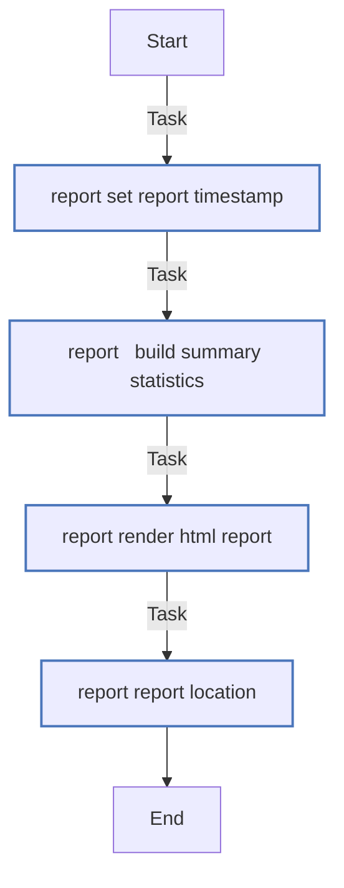
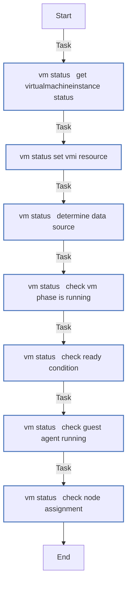
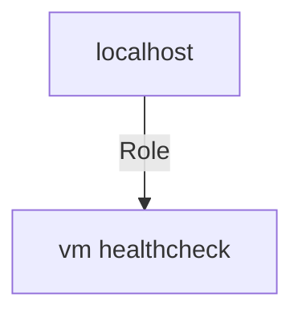

<!-- STATIC CONTENT START
Use this section for adding additional content to the README
This will not be overwritten by Docsible -->
# Role overview

This role performs health validation checks on Virtual Machines running in OpenShift Virtualization.
It verifies VM status, networking, storage, and resource configuration, and generates an HTML report
summarizing the results.

## Checks performed

- **Status**: VM phase (Running), Ready condition, guest agent presence, node assignment
- **Networking**: Interface IP assignment, interface name consistency, masquerade pod network, bridge/multus attachment
- **Storage**: PVC bound status, DataVolume succeeded status, volume attachment verification
- **Resources**: CPU/memory requests vs limits, node capacity, overcommit detection

## Usage

```yaml
---
- name: Run VM healthchecks
  hosts: localhost
  connection: local
  gather_facts: false
  roles:
    - role: infra.openshift_virtualization_ops.vm_healthcheck
      vars:
        vm_healthcheck_namespace: my-vms
        vm_healthcheck_vm_names:
          - my-vm-01
          - my-vm-02
        vm_healthcheck_report_path: /tmp/vm_healthcheck_report.html
```

Individual check categories can be disabled:

```yaml
vm_healthcheck_check_networking: false
vm_healthcheck_check_storage: false
vm_healthcheck_check_resources: false
vm_healthcheck_generate_report: false
```

<!-- STATIC CONTENT END -->
<!-- Everything below will be overwritten by Docsible -->
<!-- DOCSIBLE START -->
## vm_healthcheck

```
Role belongs to infra/openshift_virtualization_ops
Namespace - infra
Collection - openshift_virtualization_ops
Version - 1.0.3
Repository - https://github.com/redhat-cop/openshift_virtualization_ops
```

Description: Health validation and status reporting for Virtual Machines.

### Defaults

**These are static variables with lower priority**

#### File: defaults/main.yml

| Var          | Type         | Value       |Choices    |Required    | Title       |
|--------------|--------------|-------------|-------------|-------------|-------------|
| [`vm_healthcheck_cdi_api_version`](defaults/main.yml#L46)   | str   | `cdi.kubevirt.io/v1beta1` |  None  |   True  |  CDI API Version |
| [`vm_healthcheck_check_networking`](defaults/main.yml#L16)   | bool   | `True` |  None  |   False  |  Check networking |
| [`vm_healthcheck_check_resources`](defaults/main.yml#L26)   | bool   | `True` |  None  |   False  |  Check resources |
| [`vm_healthcheck_check_storage`](defaults/main.yml#L21)   | bool   | `True` |  None  |   False  |  Check storage |
| [`vm_healthcheck_generate_report`](defaults/main.yml#L31)   | bool   | `True` |  None  |   False  |  Generate report |
| [`vm_healthcheck_kubevirt_api_version`](defaults/main.yml#L41)   | str   | `kubevirt.io/v1` |  None  |   True  |  KubeVirt API Version |
| [`vm_healthcheck_namespace`](defaults/main.yml#L6)   | str   | `` |  None  |   True  |  Target namespace |
| [`vm_healthcheck_openshift_api_key`](defaults/main.yml#L56)   | str   | `{{ openshift_api_key }}` |  None  |   True  |  OpenShift API Key |
| [`vm_healthcheck_openshift_host`](defaults/main.yml#L51)   | str   | `{{ openshift_host }}` |  None  |   True  |  OpenShift host |
| [`vm_healthcheck_openshift_verify_ssl`](defaults/main.yml#L61)   | str   | `{{ openshift_verify_ssl }}` |  None  |   True  |  Enable SSL Verification |
| [`vm_healthcheck_report_path`](defaults/main.yml#L36)   | str   | `/tmp/vm_healthcheck_report.html` |  None  |   False  |  Report output path |
| [`vm_healthcheck_vm_names`](defaults/main.yml#L11)   | list   | `[]` |  None  |   False  |  List of VM names |

<summary><b>🖇️ Full descriptions for vars in defaults/main.yml</b></summary>
<br>
<b>`vm_healthcheck_cdi_api_version`:</b> CDI API Version for DataVolume lookups
<br>
<b>`vm_healthcheck_check_networking`:</b> Whether to run networking health checks
<br>
<b>`vm_healthcheck_check_resources`:</b> Whether to run resource utilization checks
<br>
<b>`vm_healthcheck_check_storage`:</b> Whether to run storage health checks
<br>
<b>`vm_healthcheck_generate_report`:</b> Whether to generate an HTML healthcheck report
<br>
<b>`vm_healthcheck_kubevirt_api_version`:</b> KubeVirt API Version
<br>
<b>`vm_healthcheck_namespace`:</b> Namespace containing VMs to healthcheck
<br>
<b>`vm_healthcheck_openshift_api_key`:</b> OpenShift API Key
<br>
<b>`vm_healthcheck_openshift_host`:</b> OpenShift host
<br>
<b>`vm_healthcheck_openshift_verify_ssl`:</b> Variable to enable SSL verification
<br>
<b>`vm_healthcheck_report_path`:</b> File path for the generated HTML healthcheck report
<br>
<b>`vm_healthcheck_vm_names`:</b> List of VM names to check. If empty, all VMs in namespace are checked
<br>
<br>

### Vars

**These are variables with higher priority**

#### File: vars/main.yml

| Var          | Type         | Value       |
|--------------|--------------|-------------|
| [vm_healthcheck_check_categories](vars/main.yml#L2)   | list   | `[]` |
| [vm_healthcheck_check_categories.0](vars/main.yml#L3)   | str   | `status` |
| [vm_healthcheck_check_categories.1](vars/main.yml#L4)   | str   | `networking` |
| [vm_healthcheck_check_categories.2](vars/main.yml#L5)   | str   | `storage` |
| [vm_healthcheck_check_categories.3](vars/main.yml#L6)   | str   | `resources` |

### Tasks

#### File: tasks/_healthcheck.yml

| Name | Module | Has Conditions |
| ---- | ------ | --------- |
| _healthcheck ¦ Verify Required Parameters | `ansible.builtin.assert` | False |
| _healthcheck ¦ Validate Report Destination | `block` | True |
| _healthcheck ¦ Check Report Directory Exists | `ansible.builtin.stat` | False |
| _healthcheck ¦ Assert Report Directory is Writable | `ansible.builtin.assert` | False |
| _healthcheck ¦ Initialize Healthcheck Results | `ansible.builtin.set_fact` | False |
| _healthcheck ¦ Discover VMs in Namespace | `kubernetes.core.k8s_info` | True |
| _healthcheck ¦ Discover Named VMs | `kubernetes.core.k8s_info` | False |
| _healthcheck ¦ Build VM List | `ansible.builtin.set_fact` | False |
| _healthcheck ¦ Verify VMs Found | `ansible.builtin.assert` | False |
| _healthcheck ¦ Run VM Status Checks | `ansible.builtin.include_tasks` | False |
| _healthcheck ¦ Run Networking Checks | `ansible.builtin.include_tasks` | True |
| _healthcheck ¦ Run Storage Checks | `ansible.builtin.include_tasks` | True |
| _healthcheck ¦ Run Resource Checks | `ansible.builtin.include_tasks` | True |
| _healthcheck ¦ Generate Healthcheck Report | `ansible.builtin.include_tasks` | True |
| _healthcheck ¦ Display Healthcheck Summary | `ansible.builtin.debug` | False |

#### File: tasks/report.yml

| Name | Module | Has Conditions |
| ---- | ------ | --------- |
| report ¦ Set Report Timestamp | `ansible.builtin.set_fact` | False |
| report ¦ Build Summary Statistics | `ansible.builtin.set_fact` | False |
| report ¦ Render HTML Report | `ansible.builtin.template` | False |
| report ¦ Report Location | `ansible.builtin.debug` | False |

#### File: tasks/vm_networking.yml

| Name | Module | Has Conditions |
| ---- | ------ | --------- |
| vm_networking ¦ Skip Networking Checks for Stopped VMs | `ansible.builtin.set_fact` | True |
| vm_networking ¦ Get VMI for Network Info | `kubernetes.core.k8s_info` | True |
| vm_networking ¦ Set VMI Network Data | `ansible.builtin.set_fact` | True |
| vm_networking ¦ Check Interface IP Assignment | `ansible.builtin.set_fact` | True |
| vm_networking ¦ Check Interface Names Match Spec | `ansible.builtin.set_fact` | True |
| vm_networking ¦ Record Interface Name Match | `ansible.builtin.set_fact` | True |
| vm_networking ¦ Check Masquerade Pod Network | `ansible.builtin.set_fact` | True |
| vm_networking ¦ Check Bridge Network Attachment | `ansible.builtin.set_fact` | True |

#### File: tasks/vm_resources.yml

| Name | Module | Has Conditions |
| ---- | ------ | --------- |
| vm_resources ¦ Extract Resource Specifications | `ansible.builtin.set_fact` | False |
| vm_resources ¦ Check CPU Requests vs Limits | `ansible.builtin.set_fact` | False |
| vm_resources ¦ Check Memory Requests vs Limits | `ansible.builtin.set_fact` | False |
| vm_resources ¦ Get Node Info for Capacity Check | `kubernetes.core.k8s_info` | True |
| vm_resources ¦ Get Node Details | `kubernetes.core.k8s_info` | True |
| vm_resources ¦ Check Node Capacity | `ansible.builtin.set_fact` | True |
| vm_resources ¦ Record Stopped VM Node Check | `ansible.builtin.set_fact` | True |
| vm_resources ¦ Flag Overcommitted VMs | `ansible.builtin.set_fact` | False |

#### File: tasks/vm_status.yml

| Name | Module | Has Conditions |
| ---- | ------ | --------- |
| vm_status ¦ Get VirtualMachineInstance Status | `kubernetes.core.k8s_info` | False |
| vm_status ¦ Set VMI Resource | `ansible.builtin.set_fact` | False |
| vm_status ¦ Determine Data Source | `ansible.builtin.set_fact` | False |
| vm_status ¦ Check VM Phase is Running | `ansible.builtin.set_fact` | False |
| vm_status ¦ Check Ready Condition | `ansible.builtin.set_fact` | False |
| vm_status ¦ Check Guest Agent Running | `ansible.builtin.set_fact` | False |
| vm_status ¦ Check Node Assignment | `ansible.builtin.set_fact` | False |

#### File: tasks/vm_storage.yml

| Name | Module | Has Conditions |
| ---- | ------ | --------- |
| vm_storage ¦ Extract Volume Claims | `ansible.builtin.set_fact` | False |
| vm_storage ¦ Check PVC Status | `kubernetes.core.k8s_info` | False |
| vm_storage ¦ Record PVC Bound Status | `ansible.builtin.set_fact` | False |
| vm_storage ¦ Check DataVolume Status | `kubernetes.core.k8s_info` | False |
| vm_storage ¦ Record DataVolume Status | `ansible.builtin.set_fact` | False |
| vm_storage ¦ Get VMI for Attached Volumes | `kubernetes.core.k8s_info` | True |
| vm_storage ¦ Check All Volumes Attached | `ansible.builtin.set_fact` | True |
| vm_storage ¦ Set Empty Attached Volumes for Stopped VMs | `ansible.builtin.set_fact` | True |
| vm_storage ¦ Record Volume Attachment | `ansible.builtin.set_fact` | False |

## Task Flow Graphs

### Graph for _healthcheck.yml

```mermaid
flowchart TD
Start
classDef block stroke:#3498db,stroke-width:2px;
classDef task stroke:#4b76bb,stroke-width:2px;
classDef includeTasks stroke:#16a085,stroke-width:2px;
classDef importTasks stroke:#34495e,stroke-width:2px;
classDef includeRole stroke:#2980b9,stroke-width:2px;
classDef importRole stroke:#699ba7,stroke-width:2px;
classDef includeVars stroke:#8e44ad,stroke-width:2px;
classDef rescue stroke:#665352,stroke-width:2px;

  Start-->|Task| _healthcheck___Verify_Required_Parameters0[ healthcheck   verify required parameters]:::task
  _healthcheck___Verify_Required_Parameters0-->|Block Start| _healthcheck___Validate_Report_Destination1_block_start_0[[ healthcheck   validate report destination<br>When: **vm healthcheck generate report   bool**]]:::block
  _healthcheck___Validate_Report_Destination1_block_start_0-->|Task| _healthcheck___Check_Report_Directory_Exists0[ healthcheck   check report directory exists]:::task
  _healthcheck___Check_Report_Directory_Exists0-->|Task| _healthcheck___Assert_Report_Directory_is_Writable1[ healthcheck   assert report directory is writable]:::task
  _healthcheck___Assert_Report_Directory_is_Writable1-.->|End of Block| _healthcheck___Validate_Report_Destination1_block_start_0
  _healthcheck___Assert_Report_Directory_is_Writable1-->|Task| _healthcheck___Initialize_Healthcheck_Results2[ healthcheck   initialize healthcheck results]:::task
  _healthcheck___Initialize_Healthcheck_Results2-->|Task| _healthcheck___Discover_VMs_in_Namespace3[ healthcheck   discover vms in namespace<br>When: **vm healthcheck vm names   length    0**]:::task
  _healthcheck___Discover_VMs_in_Namespace3-->|Task| _healthcheck___Discover_Named_VMs4[ healthcheck   discover named vms]:::task
  _healthcheck___Discover_Named_VMs4-->|Task| _healthcheck___Build_VM_List5[ healthcheck   build vm list]:::task
  _healthcheck___Build_VM_List5-->|Task| _healthcheck___Verify_VMs_Found6[ healthcheck   verify vms found]:::task
  _healthcheck___Verify_VMs_Found6-->|Include task| _healthcheck___Run_VM_Status_Checks_vm_status_yml_7[ healthcheck   run vm status checks<br>include_task: vm status yml]:::includeTasks
  _healthcheck___Run_VM_Status_Checks_vm_status_yml_7-->|Include task| _healthcheck___Run_Networking_Checks_vm_networking_yml_8[ healthcheck   run networking checks<br>When: **vm healthcheck check networking   bool**<br>include_task: vm networking yml]:::includeTasks
  _healthcheck___Run_Networking_Checks_vm_networking_yml_8-->|Include task| _healthcheck___Run_Storage_Checks_vm_storage_yml_9[ healthcheck   run storage checks<br>When: **vm healthcheck check storage   bool**<br>include_task: vm storage yml]:::includeTasks
  _healthcheck___Run_Storage_Checks_vm_storage_yml_9-->|Include task| _healthcheck___Run_Resource_Checks_vm_resources_yml_10[ healthcheck   run resource checks<br>When: **vm healthcheck check resources   bool**<br>include_task: vm resources yml]:::includeTasks
  _healthcheck___Run_Resource_Checks_vm_resources_yml_10-->|Include task| _healthcheck___Generate_Healthcheck_Report_report_yml_11[ healthcheck   generate healthcheck report<br>When: **vm healthcheck generate report   bool**<br>include_task: report yml]:::includeTasks
  _healthcheck___Generate_Healthcheck_Report_report_yml_11-->|Task| _healthcheck___Display_Healthcheck_Summary12[ healthcheck   display healthcheck summary]:::task
  _healthcheck___Display_Healthcheck_Summary12-->End
```



### Graph for report.yml



### Graph for vm_networking.yml

```mermaid
flowchart TD
Start
classDef block stroke:#3498db,stroke-width:2px;
classDef task stroke:#4b76bb,stroke-width:2px;
classDef includeTasks stroke:#16a085,stroke-width:2px;
classDef importTasks stroke:#34495e,stroke-width:2px;
classDef includeRole stroke:#2980b9,stroke-width:2px;
classDef importRole stroke:#699ba7,stroke-width:2px;
classDef includeVars stroke:#8e44ad,stroke-width:2px;
classDef rescue stroke:#665352,stroke-width:2px;

  Start-->|Task| vm_networking___Skip_Networking_Checks_for_Stopped_VMs0[vm networking   skip networking checks for stopped<br>vms<br>When: **not   vm healthcheck vmi exists   bool**]:::task
  vm_networking___Skip_Networking_Checks_for_Stopped_VMs0-->|Task| vm_networking___Get_VMI_for_Network_Info1[vm networking   get vmi for network info<br>When: **vm healthcheck vmi exists   bool**]:::task
  vm_networking___Get_VMI_for_Network_Info1-->|Task| vm_networking___Set_VMI_Network_Data2[vm networking   set vmi network data<br>When: **vm healthcheck vmi exists   bool**]:::task
  vm_networking___Set_VMI_Network_Data2-->|Task| vm_networking___Check_Interface_IP_Assignment3[vm networking   check interface ip assignment<br>When: **vm healthcheck vmi exists   bool**]:::task
  vm_networking___Check_Interface_IP_Assignment3-->|Task| vm_networking___Check_Interface_Names_Match_Spec4[vm networking   check interface names match spec<br>When: **vm healthcheck vmi exists   bool**]:::task
  vm_networking___Check_Interface_Names_Match_Spec4-->|Task| vm_networking___Record_Interface_Name_Match5[vm networking   record interface name match<br>When: **vm healthcheck vmi exists   bool**]:::task
  vm_networking___Record_Interface_Name_Match5-->|Task| vm_networking___Check_Masquerade_Pod_Network6[vm networking   check masquerade pod network<br>When: **vm healthcheck vmi exists   bool**]:::task
  vm_networking___Check_Masquerade_Pod_Network6-->|Task| vm_networking___Check_Bridge_Network_Attachment7[vm networking   check bridge network attachment<br>When: **vm healthcheck vmi exists   bool**]:::task
  vm_networking___Check_Bridge_Network_Attachment7-->End
```



### Graph for vm_resources.yml

```mermaid
flowchart TD
Start
classDef block stroke:#3498db,stroke-width:2px;
classDef task stroke:#4b76bb,stroke-width:2px;
classDef includeTasks stroke:#16a085,stroke-width:2px;
classDef importTasks stroke:#34495e,stroke-width:2px;
classDef includeRole stroke:#2980b9,stroke-width:2px;
classDef importRole stroke:#699ba7,stroke-width:2px;
classDef includeVars stroke:#8e44ad,stroke-width:2px;
classDef rescue stroke:#665352,stroke-width:2px;

  Start-->|Task| vm_resources___Extract_Resource_Specifications0[vm resources   extract resource specifications]:::task
  vm_resources___Extract_Resource_Specifications0-->|Task| vm_resources___Check_CPU_Requests_vs_Limits1[vm resources   check cpu requests vs limits]:::task
  vm_resources___Check_CPU_Requests_vs_Limits1-->|Task| vm_resources___Check_Memory_Requests_vs_Limits2[vm resources   check memory requests vs limits]:::task
  vm_resources___Check_Memory_Requests_vs_Limits2-->|Task| vm_resources___Get_Node_Info_for_Capacity_Check3[vm resources   get node info for capacity check<br>When: **vm healthcheck vmi exists   bool**]:::task
  vm_resources___Get_Node_Info_for_Capacity_Check3-->|Task| vm_resources___Get_Node_Details4[vm resources   get node details<br>When: **vm healthcheck vmi exists   bool and  vm<br>healthcheck resources vmi resources 0  status<br>nodename is defined**]:::task
  vm_resources___Get_Node_Details4-->|Task| vm_resources___Check_Node_Capacity5[vm resources   check node capacity<br>When: **vm healthcheck vmi exists   bool and  vm<br>healthcheck resources vmi resources   default     <br> length   0**]:::task
  vm_resources___Check_Node_Capacity5-->|Task| vm_resources___Record_Stopped_VM_Node_Check6[vm resources   record stopped vm node check<br>When: **not   vm healthcheck vmi exists   bool**]:::task
  vm_resources___Record_Stopped_VM_Node_Check6-->|Task| vm_resources___Flag_Overcommitted_VMs7[vm resources   flag overcommitted vms]:::task
  vm_resources___Flag_Overcommitted_VMs7-->End
```



### Graph for vm_status.yml



### Graph for vm_storage.yml

```mermaid
flowchart TD
Start
classDef block stroke:#3498db,stroke-width:2px;
classDef task stroke:#4b76bb,stroke-width:2px;
classDef includeTasks stroke:#16a085,stroke-width:2px;
classDef importTasks stroke:#34495e,stroke-width:2px;
classDef includeRole stroke:#2980b9,stroke-width:2px;
classDef importRole stroke:#699ba7,stroke-width:2px;
classDef includeVars stroke:#8e44ad,stroke-width:2px;
classDef rescue stroke:#665352,stroke-width:2px;

  Start-->|Task| vm_storage___Extract_Volume_Claims0[vm storage   extract volume claims]:::task
  vm_storage___Extract_Volume_Claims0-->|Task| vm_storage___Check_PVC_Status1[vm storage   check pvc status]:::task
  vm_storage___Check_PVC_Status1-->|Task| vm_storage___Record_PVC_Bound_Status2[vm storage   record pvc bound status]:::task
  vm_storage___Record_PVC_Bound_Status2-->|Task| vm_storage___Check_DataVolume_Status3[vm storage   check datavolume status]:::task
  vm_storage___Check_DataVolume_Status3-->|Task| vm_storage___Record_DataVolume_Status4[vm storage   record datavolume status]:::task
  vm_storage___Record_DataVolume_Status4-->|Task| vm_storage___Get_VMI_for_Attached_Volumes5[vm storage   get vmi for attached volumes<br>When: **vm healthcheck vmi exists   bool**]:::task
  vm_storage___Get_VMI_for_Attached_Volumes5-->|Task| vm_storage___Check_All_Volumes_Attached6[vm storage   check all volumes attached<br>When: **vm healthcheck vmi exists   bool**]:::task
  vm_storage___Check_All_Volumes_Attached6-->|Task| vm_storage___Set_Empty_Attached_Volumes_for_Stopped_VMs7[vm storage   set empty attached volumes for<br>stopped vms<br>When: **not   vm healthcheck vmi exists   bool**]:::task
  vm_storage___Set_Empty_Attached_Volumes_for_Stopped_VMs7-->|Task| vm_storage___Record_Volume_Attachment8[vm storage   record volume attachment]:::task
  vm_storage___Record_Volume_Attachment8-->End
```



## Playbook

```yml
---
- name: Test vm_healthcheck role
  hosts: localhost
  connection: local
  gather_facts: false
  roles:
    - role: vm_healthcheck
...

```

## Playbook graph



## Author Information

OpenShift Virtualization Migration Contributors

## License

GPL-3.0-only

## Minimum Ansible Version

2.15.0

## Platforms

No platforms specified.

<!-- DOCSIBLE END -->