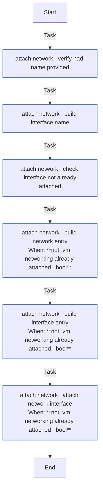
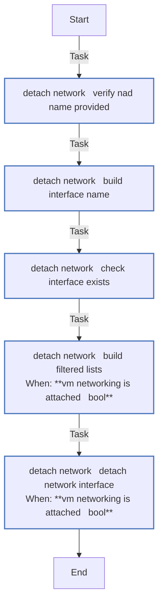
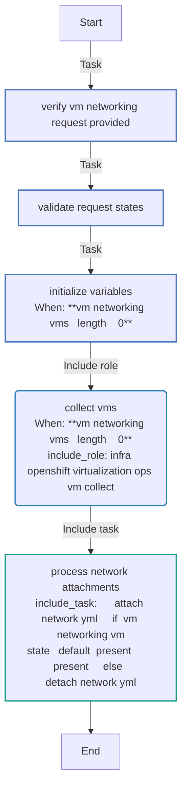
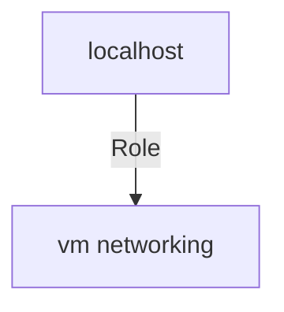

<!-- STATIC CONTENT START
Use this section for adding additional content to the README
This will not be overwritten by Docsible -->
# 📃 Role overview

<!-- STATIC CONTENT END -->
<!-- Everything below will be overwritten by Docsible -->
<!-- DOCSIBLE START -->
## vm_networking

```
Role belongs to infra/openshift_virtualization_ops
Namespace - infra
Collection - openshift_virtualization_ops
Version - 1.0.3
Repository - https://github.com/redhat-cop/openshift_virtualization_ops
```

Description: Manage network attachments on OpenShift Virtualization VMs

### Defaults

**These are static variables with lower priority**

#### File: defaults/main.yml

| Var          | Type         | Value       |Choices    |Required    | Title       |
|--------------|--------------|-------------|-------------|-------------|-------------|
| [`vm_networking_api_key`](defaults/main.yml#L23)   | str   | `{{ openshift_api_key }}` |  None  |   True  |  OpenShift API Key |
| [`vm_networking_openshift_host`](defaults/main.yml#L19)   | str   | `{{ openshift_host }}` |  None  |   True  |  OpenShift Host |
| [`vm_networking_openshift_verify_ssl`](defaults/main.yml#L27)   | str   | `{{ openshift_verify_ssl }}` |  None  |   True  |  Verify SSL Certificate |
| [`vm_networking_request`](defaults/main.yml#L7)   | list   | `[]` |  None  |   True  |  Network Attachment Requests |
| [`vm_networking_vms`](defaults/main.yml#L34)   | list   | `[]` |  None  |   False  |  Pre-collected VMs |

<summary><b>🖇️ Full descriptions for vars in defaults/main.yml</b></summary>
<br>
<b>`vm_networking_api_key`:</b> OpenShift API Key
<br>
<b>`vm_networking_openshift_host`:</b> OpenShift Host
<br>
<b>`vm_networking_openshift_verify_ssl`:</b> Verify SSL Certificate
<br>
<b>`vm_networking_request`:</b> List of network attachment requests
<br>
<b>`vm_networking_vms`:</b> >
<br>
<br>

### Vars

**These are variables with higher priority**

#### File: vars/main.yml

| Var          | Type         | Value       |
|--------------|--------------|-------------|
| [vm_networking_valid_states](vars/main.yml#L3)   | list   | `[]` |
| [vm_networking_valid_states.0](vars/main.yml#L4)   | str   | `present` |
| [vm_networking_valid_states.1](vars/main.yml#L5)   | str   | `absent` |

### Tasks

#### File: tasks/main.yml

| Name | Module | Has Conditions |
| ---- | ------ | --------- |
| Verify vm_networking_request Provided | `ansible.builtin.assert` | False |
| Validate Request States | `ansible.builtin.assert` | False |
| Initialize Variables | `ansible.builtin.set_fact` | True |
| Collect VMs | `ansible.builtin.include_role` | True |
| Process Network Attachments | `ansible.builtin.include_tasks` | False |

#### File: tasks/_attach_network.yml

| Name | Module | Has Conditions |
| ---- | ------ | --------- |
| _attach_network ¦ Verify NAD Name Provided | `ansible.builtin.assert` | False |
| _attach_network ¦ Build Interface Name | `ansible.builtin.set_fact` | False |
| _attach_network ¦ Check Interface Not Already Attached | `ansible.builtin.set_fact` | False |
| _attach_network ¦ Build Network Entry | `ansible.builtin.set_fact` | True |
| _attach_network ¦ Build Interface Entry | `ansible.builtin.set_fact` | True |
| _attach_network ¦ Attach Network Interface | `kubernetes.core.k8s` | True |

#### File: tasks/_detach_network.yml

| Name | Module | Has Conditions |
| ---- | ------ | --------- |
| _detach_network ¦ Verify NAD Name Provided | `ansible.builtin.assert` | False |
| _detach_network ¦ Build Interface Name | `ansible.builtin.set_fact` | False |
| _detach_network ¦ Check Interface Exists | `ansible.builtin.set_fact` | False |
| _detach_network ¦ Build Filtered Lists | `ansible.builtin.set_fact` | True |
| _detach_network ¦ Detach Network Interface | `kubernetes.core.k8s` | True |

## Task Flow Graphs

### Graph for _attach_network.yml



### Graph for _detach_network.yml



### Graph for main.yml



## Playbook

```yml
---
- name: Test
  hosts: localhost
  remote_user: root
  roles:
    - vm_networking
...

```

## Playbook graph



## Author Information

OpenShift Virtualization Migration Contributors

## License

GPL-3.0-or-later

## Minimum Ansible Version

2.16

## Platforms

* **EL**: ['9']

<!-- DOCSIBLE END -->