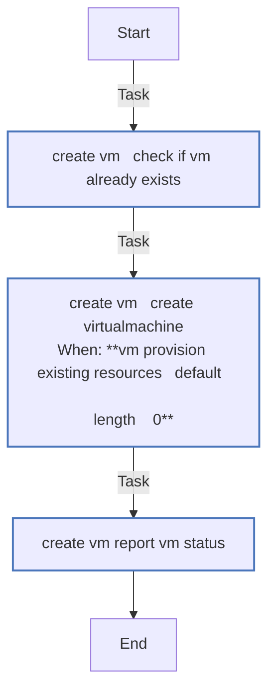
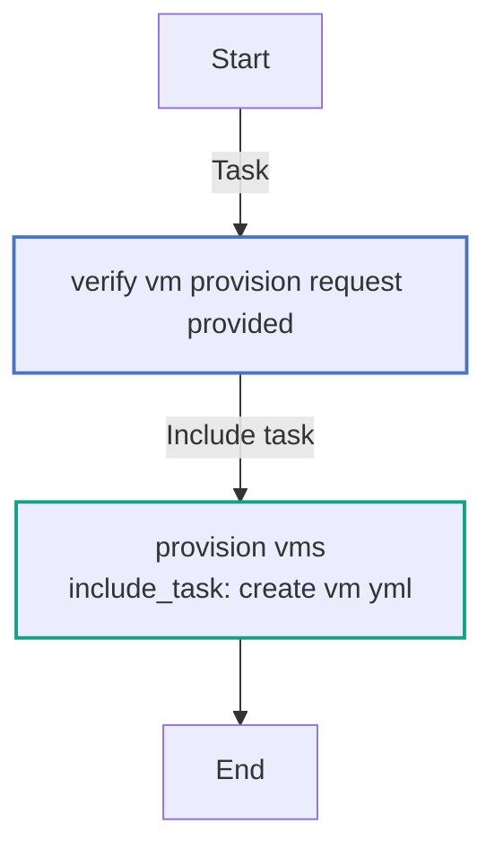

<!-- DOCSIBLE START -->
## vm_provision

```
Role belongs to infra/openshift_virtualization_ops
Namespace - infra
Collection - openshift_virtualization_ops
Version - 1.0.3
Repository - https://github.com/redhat-cop/openshift_virtualization_ops
```

Description: Provision VirtualMachines on OpenShift Virtualization from specs

### Defaults

**These are static variables with lower priority**

#### File: defaults/main.yml

| Var          | Type         | Value       |Choices    |Required    | Title       |
|--------------|--------------|-------------|-------------|-------------|-------------|
| [`vm_provision_api_key`](defaults/main.yml#L16)   | str   | `{{ openshift_api_key }}` |  None  |   True  |  OpenShift API Key |
| [`vm_provision_kubevirt_api_version`](defaults/main.yml#L24)   | str   | `kubevirt.io/v1` |  None  |   True  |  KubeVirt API Version |
| [`vm_provision_openshift_host`](defaults/main.yml#L12)   | str   | `{{ openshift_host }}` |  None  |   True  |  OpenShift Host |
| [`vm_provision_openshift_verify_ssl`](defaults/main.yml#L20)   | str   | `{{ openshift_verify_ssl }}` |  None  |   True  |  Verify SSL Certificate |
| [`vm_provision_request`](defaults/main.yml#L7)   | list   | `[]` |  None  |   True  |  VM Provision Requests |

<summary><b>🖇️ Full descriptions for vars in defaults/main.yml</b></summary>
<br>
<b>`vm_provision_api_key`:</b> OpenShift API Key
<br>
<b>`vm_provision_kubevirt_api_version`:</b> KubeVirt API Version
<br>
<b>`vm_provision_openshift_host`:</b> OpenShift Host
<br>
<b>`vm_provision_openshift_verify_ssl`:</b> Verify SSL Certificate
<br>
<b>`vm_provision_request`:</b> List of KubeVirt VirtualMachine specs to create
<br>
<br>

### Tasks

#### File: tasks/main.yml

| Name | Module | Has Conditions |
| ---- | ------ | --------- |
| Verify vm_provision_request Provided | `ansible.builtin.assert` | False |
| Provision VMs | `ansible.builtin.include_tasks` | False |

#### File: tasks/_create_vm.yml

| Name | Module | Has Conditions |
| ---- | ------ | --------- |
| _create_vm ¦ Check if VM Already Exists | `kubernetes.core.k8s_info` | False |
| _create_vm ¦ Create VirtualMachine | `kubernetes.core.k8s` | True |
| _create_vm ¦ Report VM Status | `ansible.builtin.debug` | False |

## Task Flow Graphs

### Graph for _create_vm.yml



### Graph for main.yml



## Author Information

OpenShift Virtualization Migration Contributors

## License

GPL-3.0-or-later

## Minimum Ansible Version

2.16

## Platforms

* **EL**: ['9']

<!-- DOCSIBLE END -->
