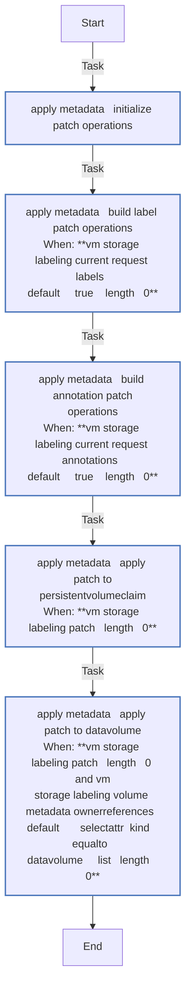
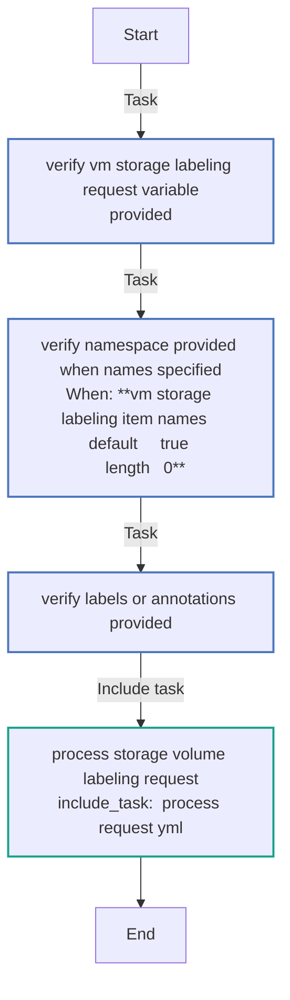
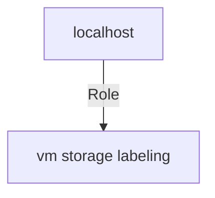

# vm_storage_labeling

Add labels, annotations, and descriptive names to storage volumes (PVCs and DataVolumes) in OpenShift Virtualization.

## Requirements

* `redhat.openshift_virtualization` collection
* `kubernetes.core` collection
* OpenShift cluster with Virtualization operator installed

## Role Variables

See `defaults/main.yml` for available variables.

## License

GPL-3.0-or-later
<!-- DOCSIBLE START -->
## vm_storage_labeling

```
Role belongs to infra/openshift_virtualization_ops
Namespace - infra
Collection - openshift_virtualization_ops
Version - 1.0.3
Repository - https://github.com/redhat-cop/openshift_virtualization_ops
```

Description: Add labels, annotations, and descriptive names to storage volumes (PVCs and DataVolumes).

### Defaults

**These are static variables with lower priority**

#### File: defaults/main.yml

| Var          | Type         | Value       |Choices    |Required    | Title       |
|--------------|--------------|-------------|-------------|-------------|-------------|
| [`vm_storage_labeling_api_key`](defaults/main.yml#L27)   | str   | `{{ openshift_api_key }}` |  None  |   True  |  OpenShift API Key |
| [`vm_storage_labeling_openshift_host`](defaults/main.yml#L23)   | str   | `{{ openshift_host }}` |  None  |   True  |  OpenShift Host |
| [`vm_storage_labeling_openshift_verify_ssl`](defaults/main.yml#L31)   | str   | `{{ openshift_verify_ssl }}` |  None  |   True  |  Verify SSL Certificate |
| [`vm_storage_labeling_request`](defaults/main.yml#L7)   | list   | `[]` |  None  |   True  |  Storage Volume Labeling Request |

<summary><b>🖇️ Full descriptions for vars in defaults/main.yml</b></summary>
<br>
<b>`vm_storage_labeling_api_key`:</b> OpenShift API Key
<br>
<b>`vm_storage_labeling_openshift_host`:</b> OpenShift Host
<br>
<b>`vm_storage_labeling_openshift_verify_ssl`:</b> Verify SSL Certificate
<br>
<b>`vm_storage_labeling_request`:</b> List of Storage Volume Labeling Requests
<br>
<br>

### Tasks

#### File: tasks/main.yml

| Name | Module | Has Conditions |
| ---- | ------ | --------- |
| Verify vm_storage_labeling_request Variable Provided | `ansible.builtin.assert` | False |
| Verify Namespace Provided When Names Specified | `ansible.builtin.assert` | True |
| Verify Labels or Annotations Provided | `ansible.builtin.assert` | False |
| Process Storage Volume Labeling Request | `ansible.builtin.include_tasks` | False |

#### File: tasks/_apply_metadata.yml

| Name | Module | Has Conditions |
| ---- | ------ | --------- |
| _apply_metadata ¦ Initialize Patch Operations | `ansible.builtin.set_fact` | False |
| _apply_metadata ¦ Build Label Patch Operations | `ansible.builtin.set_fact` | True |
| _apply_metadata ¦ Build Annotation Patch Operations | `ansible.builtin.set_fact` | True |
| _apply_metadata ¦ Apply Patch to PersistentVolumeClaim | `kubernetes.core.k8s_json_patch` | True |
| _apply_metadata ¦ Apply Patch to DataVolume | `kubernetes.core.k8s_json_patch` | True |

#### File: tasks/_process_request.yml

| Name | Module | Has Conditions |
| ---- | ------ | --------- |
| _process_request ¦ Query PVCs by Name | `kubernetes.core.k8s_info` | True |
| _process_request ¦ Query PVCs by Label Selector | `kubernetes.core.k8s_info` | True |
| _process_request ¦ Query All PVCs in Namespace | `kubernetes.core.k8s_info` | True |
| _process_request ¦ Build Volume List from Named PVCs | `ansible.builtin.set_fact` | True |
| _process_request ¦ Build Volume List from Selector PVCs | `ansible.builtin.set_fact` | True |
| _process_request ¦ Build Volume List from All PVCs | `ansible.builtin.set_fact` | True |
| _process_request ¦ Verify Volumes Found | `ansible.builtin.assert` | False |
| _process_request ¦ Apply Labels and Annotations to Volumes | `ansible.builtin.include_tasks` | False |

## Task Flow Graphs

### Graph for _apply_metadata.yml



### Graph for _process_request.yml

```mermaid
flowchart TD
Start
classDef block stroke:#3498db,stroke-width:2px;
classDef task stroke:#4b76bb,stroke-width:2px;
classDef includeTasks stroke:#16a085,stroke-width:2px;
classDef importTasks stroke:#34495e,stroke-width:2px;
classDef includeRole stroke:#2980b9,stroke-width:2px;
classDef importRole stroke:#699ba7,stroke-width:2px;
classDef includeVars stroke:#8e44ad,stroke-width:2px;
classDef rescue stroke:#665352,stroke-width:2px;

  Start-->|Task| _process_request___Query_PVCs_by_Name0[ process request   query pvcs by name<br>When: **vm storage labeling current request names  <br>default     true    length   0**]:::task
  _process_request___Query_PVCs_by_Name0-->|Task| _process_request___Query_PVCs_by_Label_Selector1[ process request   query pvcs by label selector<br>When: **vm storage labeling current request label<br>selectors   default     true    length   0**]:::task
  _process_request___Query_PVCs_by_Label_Selector1-->|Task| _process_request___Query_All_PVCs_in_Namespace2[ process request   query all pvcs in namespace<br>When: **vm storage labeling current request names  <br>default     true    length    0 and vm storage<br>labeling current request label selectors   default<br>    true    length    0**]:::task
  _process_request___Query_All_PVCs_in_Namespace2-->|Task| _process_request___Build_Volume_List_from_Named_PVCs3[ process request   build volume list from named<br>pvcs<br>When: **vm storage labeling pvc by name is not skipped**]:::task
  _process_request___Build_Volume_List_from_Named_PVCs3-->|Task| _process_request___Build_Volume_List_from_Selector_PVCs4[ process request   build volume list from selector<br>pvcs<br>When: **vm storage labeling pvc by selector is not skipped**]:::task
  _process_request___Build_Volume_List_from_Selector_PVCs4-->|Task| _process_request___Build_Volume_List_from_All_PVCs5[ process request   build volume list from all pvcs<br>When: **vm storage labeling pvc all is not skipped**]:::task
  _process_request___Build_Volume_List_from_All_PVCs5-->|Task| _process_request___Verify_Volumes_Found6[ process request   verify volumes found]:::task
  _process_request___Verify_Volumes_Found6-->|Include task| _process_request___Apply_Labels_and_Annotations_to_Volumes__apply_metadata_yml_7[ process request   apply labels and annotations to<br>volumes<br>include_task:  apply metadata yml]:::includeTasks
  _process_request___Apply_Labels_and_Annotations_to_Volumes__apply_metadata_yml_7-->End
```



### Graph for main.yml



## Playbook

```yml
---
- name: Test
  hosts: localhost
  remote_user: root
  roles:
    - vm_storage_labeling
...

```

## Playbook graph



## Author Information

OpenShift Virtualization Migration Contributors

## License

GPL-3.0-or-later

## Minimum Ansible Version

2.16

## Platforms

No platforms specified.

<!-- DOCSIBLE END -->